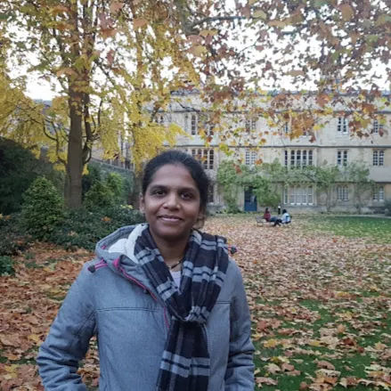

## About Me

Hi! I am currently an International Associate at the National Institute of Standards and Technology, USA. I finished my Ph.D. at the University of Calgary under the supervision of <a href= "https://pages.cpsc.ucalgary.ca/~robin/"> Dr. Robin Cockett </a>. 

I am interested in Category Theory and its applications to quantum computing. I would describe myself as a Computer Scientist and a Category Theorist. 

 Keywords:  Linearly distributive categories, categorical quantum mechanics

<a href="https://scholar.google.ca/citations?hl=en&user=Ue7tYysAAAAJ">Google Scholar </a>; <a href="https://github.com/priyaasrini">GitHub</a> 

## Credentials

* Ph.D. in Computer Science (Sep 2021) University of Calgary, Canada
* SoTL Advancing Graduate Education in STEM (SAGES) certification (Sep 2019 - Apr 2020) University of Calgary, Canada 
* Masters of Mathematics in Computer Science (Dec 2014) University of Waterloo, Canada
* Bachelors of Computer Science Engineering (May 2009) Madras Institute of Technology, India

## Teaching

*  Sessional Lecturer  (Sep 2021 - Dec 2021) University of British Columbia, Canada   CPSC 213 - Introduction to Computer Systems
*  Teaching Assistant  (Jan 2015 - Apr 2021) University of Calgary, Canada  
CPSC 457 – Operating systems for Dr. Kawash, and Dr. Federl  
CPSC 313 – Computability theory for Dr. Reardon, Dr. Eberly, and Dr. Scheidler   
CPSC 411 – Compiler construction for Dr. Cockett  
CPSC 449 – Programming Paradigms for Dr. Cockett   
In Winter 2016, I was the Head Teaching Assistant of CPSC 457 and effectively trained fellow teaching assistants in kernel programming.

* Teaching Assistant  (Sep 2012 - Dec 2014) University of Waterloo, Canada  
CS 452 – Real time programming for Dr. Cowan  
CS 454 – Computer networks for Dr. Karsten  
CS 343 – Concurrent and parallel programming under Dr. Buhr  

## Publications and Preprints

 Robin Cockett, Isabelle Jianing, Carlo Maria Scandolo and *Priyaa Srinivasan*, "Extending monotones as Kan extensions". To appear in the conference proceedings of 4th International Conference on Applied Category Theory, 2022 

 Robin Cockett, Cole Comfort, and *Priyaa Srinivasan*. "Dagger linear logic for categorical quantum mechanics". Logical Methods in Computer Science, 17(5), Nov. 2021 

 Robin Cockett and *Priyaa Srinivasan*, "Exponential modalities and Complementarity". To appear in the conference proceedings of Applied Category Theory, 2021 
  
 Robin Cockett and *Priyaa Srinivasan*, "Completely positive maps for mixed unitary categories". ArXiv:1905.08877 [math.CT], May. 2019

 Robin Cockett, Cole Comfort, and *Priyaa Srinivasan*, "The category CNOT". Electronic Proceedings in Theoretical Computer Science 266, pp. 258-293, Quantum Phy. and Logic, 2017

 Srinivasan Arunachalam, Vlad Gheorghiu, Tomas Jochym-O'Connor, Michele Mosca, and *Priyaa Srinivasan*. "On the robustness of bucket brigade quantum RAM". New Journal of Physics, 17(12), 123010, Dec. 2015

## Committees

Sponsorship Chair, 6th International Conference on Applied Category Theory (July 2023) 

Co-chair, NIST workshop on Compositional structures for Systems Engineering and Design (Nov 2022) 

Co-organizer, 27th Foundational Methods in Computer Science Workshop (July 2019) 

## Service 

Volunteer (Aug 2019 - Apr 2020) Let's Talk Science, University of Calgary 

Garden Leader (May 2019 - Apr 2020) Garden Club, University of Calgary 

Event Coordinator (May 2019 - Apr 2020) Campus Community Kitchen, University of Calgary 

Volunteer (Apr 2016 - Aug 2020) Biodiversity Bee, Brentwood Community Association, Canada 

Vice President Communications (Jan 2016 - Aug 2016) Computer Sci. Grad. Student Association, University of Calgary 

Founder and Coordinator (May 2014 - Dec 2014) Healthy Living, University of Waterloo 

Graduate Student Ambassador (Oct 2013 - Dec 2014) University of Waterloo 

---

 Peace is a disarming concept 

<!-- ## Typography

This is a [link](http://google.com). Something *italics* and something **bold**.

Here is a table

Year | Award | Category
-----|-------|--------
2014 | Emmy  | Won Outstanding Lead Actor in a miniseries or a movie
2015 | BAFTA | Nominated for Best Leading Actor for Sherlock
2014 | Satellite | Won Best Actor miniseries or television film

Here is a horizontal rule -->

